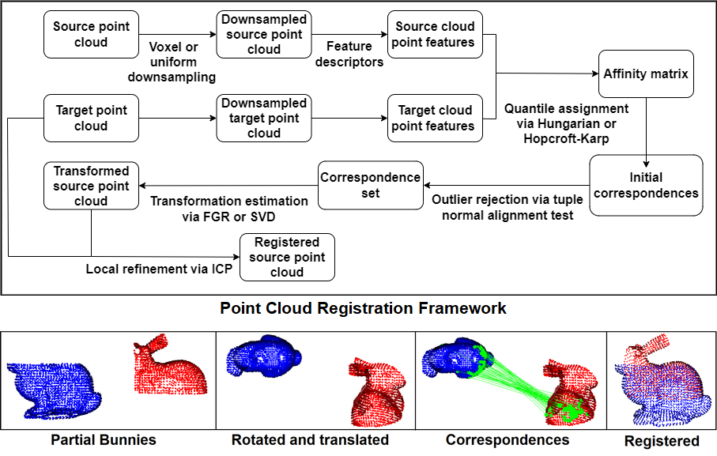
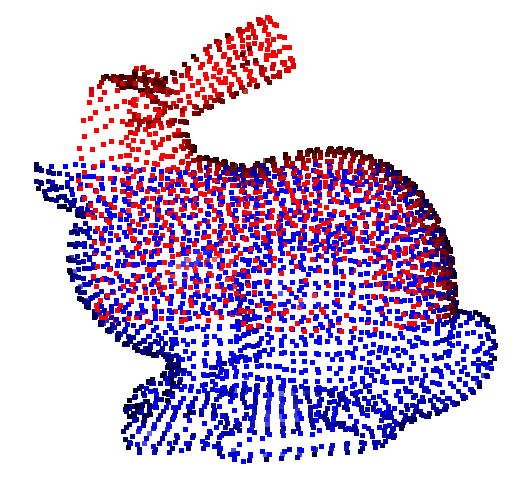

# Point Cloud Registration With Quantile Assignment



We refined the quantile assignment algorithm by integrating prevalent feature descriptors and transformation estimation methods to enhance the correspondence between the source and target point clouds. We evaluated the performances of these descriptors and methods with our approach through controlled experiments on a dataset we constructed using well-known 3D models. This systematic investigation led us to identify the most suitable methods for complementing our approach. Subsequently, we devised a new end-to-end, coarse-to-fine pairwise point cloud registration framework. Finally, we tested our framework on indoor and outdoor benchmark datasets and compared our results with state-of-the-art point cloud registration methods.

Requirements:
* Python >= 3.9.13
* Open3D >= 0.15.1
* Numba >= 0.55 (For CUDA GPU support, please follow Numba installation instructions)
* hydra-core >= 1.3.2
* Tqdm

We used conda to create the environment on Windows.

```
conda env create -f environment.yaml -p <environment_path>
```

:warning: Before running the tests, make sure the ```PYTHONPATH``` includes the repository root.

# Open3D Tests

To run the pipeline on example points clouds from Open3D (Stanford Bunny and Armadillo) run the ```Code\benchmark\tests\open3d_tests.py``` file.

Example results for horizontally split Stanford Bunny:




# Dataset Tests

We use ```hydra``` to manage the test configurations. Modify ```edit_me.yaml``` under ```Code\benchmark\configs``` according to method and dataset choices. Then run ```Code\benchmark\dataset_tests.py``` to run the tests.

Make sure all paths are absolute.

In addition to ```hydra``` we export the used parameters as ```parameters.txt```.

To perform our tests using FCGF features, you need to install and run the tests on modified version of FCGF repository.
The tests are originally performed on Ubuntu.

- The original repository: https://github.com/chrischoy/FCGF
- Modified repository: https://github.com/YalimD/FCGF_QuantileEdition

# Synthetic Dataset

We provide our synthetic dataset at: [Link](https://drive.google.com/file/d/109oFqEthXG7Pu-XMD0y8vQhjx-p3xpaB/view?usp=sharing). Put the downloaded content under ```Data\Synthetic```.

Edit the ```Code\benchmark\configs\dataset\Synthetic.yaml``` accordingly. 

| Name   | Standard Assignment            | Quantile Assignment            |
|--------|--------------------------------|--------------------------------|
| Angel  |   |   |
| Dragon |  |  |
| Bunny  |   |   |


# 3DMatch Tests

Go to https://3dmatch.cs.princeton.edu/#geometric-registration-benchmark and download all 8 scenes together with their evaluation files.

Export them to desired location and edit the ```Code\benchmark\configs\dataset\3DMatch.yaml``` accordingly.


# KITTI Tests

Download the KITTI dataset from https://www.cvlibs.net/datasets/kitti/eval_odometry.php and process the points clouds following https://github.com/qinzheng93/GeoTransformer/blob/main/README.md#kitti-odometry.

Edit the ```Code\benchmark\configs\dataset\KITTI.yaml``` accordingly.

We adapted the KITTI test code from 
- https://github.com/qinzheng93/GeoTransformer/blob/main/data/Kitti/downsample_pcd.py
- https://github.com/chrischoy/FCGF/blob/master/lib/data_loaders.py


# Visualizer

We also provide a tool for feature distance visualization using an Open3D based application.  Run ```Code\experimental\featureVisualizer.py```. 

Example screenshot from the application below: the green dot is the selected point where other model is colored according 
affinity distances. Please check the paper for affinity calculation. Distances increase from red to blue. 


# References

If you found this work useful, please cite:

Ecenur Oğuz, Yalım Doğan, Uğur Güdükbay, Oya Karaşan, and Mustafa Pınar. Point Cloud Registration with Quantile Assignment. Machine Vision and Applications, 35(3):Article No. 38, 17 pages, May 2024.

```
@Article{OguzDGKP24,
  author    = {Ecenur O{\^g}uz and
               Yal{\i}m Do{\^g}an and
               U{\^g}ur G{\"u}d{\"u}kbay and
               Oya Kara{\c s}an and
               Mustafa P{\i}nar},
  title     = {Point Cloud Registration with Quantile Assignment},
  journal   = {Machine Vision and Applications},
  volume    = {35},
  number    = {3},
  year      = {2024},
  month     = {May},
  pages     = {Article No. 38, 17 pages},
  keywords = {Point cloud registration, Fast point feature histograms (FPFH) descriptor, Quantile assignment, 
              Iterative closest-point algorithm, Bipartite graph matching, Hungarian algorithm, Hopcroft-Karp algorithm},
  abstract = {Point cloud registration is a fundamental problem in computer vision. The problem encompasses 
              critical tasks such as feature estimation, correspondence matching, and transformation estimation. 
              The point cloud registration problem can be cast as aquantile matching problem. We refined the 
              quantile assignment algorithm by integrating prevalent feature descriptors and transformation 
              estimation methods to enhance the correspondence between the source and target point clouds. 
              We evaluated theperformances of these descriptors and methods with our approach through controlled
              experiments on a dataset we constructedusing well-known 3D models. This systematic investigation 
              led us to identify the most suitable methods for complementingour approach. Subsequently, 
              we devised a new end-to-end, coarse-to-fine pairwise point cloud registration framework. 
              Finally, we tested our framework on indoor and outdoor benchmark datasets and compared 
              our results with state-of-the-art point cloudregistration methods.},
  ee        = {https://doi.org/10.1007/s00138-024-01517-3}
}
```